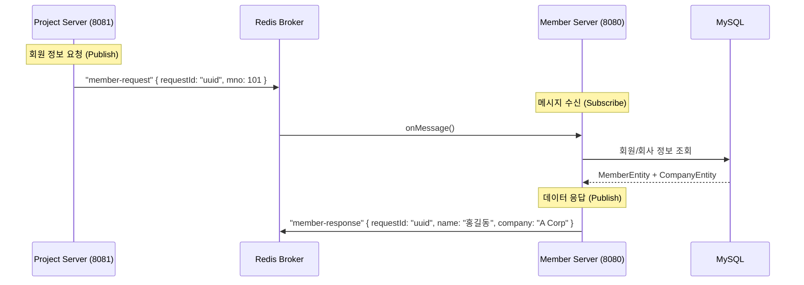

-----

# 👤 LC-Eye Member Server – 인증 및 회원 관리 MSA

> **MSA 아키텍처에서 사용자 인증(Authentication)과 회원 데이터 관리를 전담하는 독립 서버**<br>
> 🔗 프로젝트Notion [바로가기](https://lceye.notion.site/LC-Eye-2a2094d4983480369aa4fe1a6163688f) <br>
> 🔗 단일 서버용 GitHub [GitHub 바로가기](https://github.com/JeonghoonAHN0510/LC-Eye) <br>
> 🔗 다중 서버용 GitHub [Back_Member](https://github.com/JeonghoonAHN0510/LC-Eye_Member) &nbsp;|&nbsp; [Back_Project](https://github.com/JeonghoonAHN0510/LC-Eye_Project) &nbsp;|&nbsp; [React](https://github.com/JeonghoonAHN0510/LC-Eye_React) &nbsp;|&nbsp; [Flutter](https://github.com/JeonghoonAHN0510/LC-Eye_Flutter) <br>
> 📃 발표자료 [PDF 바로가기](https://drive.google.com/file/d/139mwUQxmyiBQZLN5WCTaBkCL4sBBORIk/view?usp=sharing) <br>
> 💻 시연영상 [영상 바로보기](https://drive.google.com/file/d/1objnc56YuQeHpYGFZkyLe-8hU9B_7Fpt/view)

-----

## 🧭 프로젝트 개요

**LC-Eye**는 제품·공정 단위의 투입물·산출물 데이터를 기반으로 환경부하를 정량화하는 툴입니다.
서비스의 확장성과 유지보수성을 높이기 위해 \*\*Member Server(회원/인증)\*\*와 \*\*Project Server(계산/관리)\*\*로 백엔드를 분리하였으며, **Redis Pub/Sub**를 통해 서버 간 데이터 정합성을 유지합니다.

프론트엔드는 **React**로 구축하여 SPA(Single Page Application) 기반의 끊김 없는 사용자 경험을 제공하며, 대용량 데이터 처리와 실시간 상호작용에 최적화된 아키텍처를 갖추고 있습니다.

  - **개발기간:** 2025.11.05 \~ 2025.11.27 (3주)
  - **팀명:** LC-Eye
  - **인원:** 3명
    - 옹태경 - **팀장** / LCI 계산 로직 / S3 파일 처리 / Front 총괄 / 발표
    - 민성호 - **JSON 추천 로직** / 투입물·산출물·process 로직 / Flutter 총괄
    - 안정훈 - **MSA 기반 서버 분리** / 서버 간 통신 / Redisson 분산 락 / 버전 관리 / Front 공통 레이아웃

-----

## 🚀 핵심 목표

| 구분 | 설명 |
|------|------|
| 🔐 **통합 인증 시스템** | JWT(Access Token) 발급 및 검증을 전담하며, 웹(Session)과 앱(Header) 인증 방식 동시 지원 |
| 📡 **데이터 허브 역할** | Redis Pub/Sub 채널(`member-request`)을 구독하여, Project Server의 요청에 실시간으로 회원 정보를 응답 |
| ⚡ **고성능 세션 관리** | Redis를 활용하여 로그인 토큰의 생명주기(TTL)를 관리하고, 로그아웃 시 즉각적인 토큰 무효화 처리 |
| 🏗️ **MSA 독립성 확보** | 프로젝트 계산 로직(Project Server)과 인증 로직(Member Server)을 물리적으로 분리하여 장애 전파 방지 |

-----

## ⚙️ 개발환경

| 분류 | 기술 스택 |
|------|-------------|
| **Framework** | Java 17, Spring Boot |
| **Security** | **Spring Security**, JWT (Json Web Token) |
| **Database** | MySQL (User/Company Data), **Redis** (Session/Pub-Sub) |
| **Build Tool** | Gradle |
| **ORM / Mapper** | Spring Data JPA, MyBatis |

-----

## 🧱 아키텍처 및 통신 구조

### 🔄 Redis Pub/Sub Responder (응답자)

Member 서버는 Project 서버와 직접적인 HTTP 통신을 하지 않고, **Redis Message Broker**를 통해 데이터를 교환합니다.

1.  **구독 (Subscribe):** 서버 시작 시 `member-request` 채널을 구독합니다.
2.  **수신 (Listen):** Project Server가 특정 회원의 정보(`mno`)를 요청하면 메시지를 수신합니다.
3.  **조회 (Query):** DB에서 해당 회원 및 회사 정보를 조회합니다.
4.  **발행 (Publish):** 조회된 정보를 DTO에 담아 `member-response` 채널로 발행합니다.

<!-- end list -->



-----

## 🧩 주요 기능 및 API

### 1\. 인증 및 로그인 (`MemberController`)

  - **웹 로그인 (`/api/member/login`):** 로그인 성공 시 JWT를 생성하여 Redis Session에 저장하고 쿠키/세션 ID 반환
  - **앱 로그인 (`/api/member/flutter/login`):** JWT 토큰을 직접 Body로 반환 (Bearer Token 방식)
  - **로그아웃:** Redis에서 해당 사용자의 토큰 키를 삭제하여 즉시 접근 차단

### 2\. 정보 제공 서비스 (`MemberService`)

  - **내 정보 조회 (`/api/member/getinfo`):** 토큰을 파싱하여 현재 로그인한 사용자의 권한(Role), 회사 정보(Cno), 회원 번호(Mno) 반환
  - **토큰 검증 (`JwtService`):** 들어오는 요청의 헤더 또는 세션에서 토큰을 추출하여 유효성 및 만료 여부 검증

### 3\. MSA 데이터 연동 (`RedisService`)

  - **트랜잭션 보장:** JPA 지연 로딩(Lazy Loading) 이슈를 해결하기 위해 리스너 로직 내 트랜잭션 범위 설정

-----

## 🔍 디렉토리 구조

```bash
LC-Eye_Member/src/main/java/lceye/
├── config/                 # Security, Redis, CORS, JWT 설정
│   ├── SecurityConfig.java
│   └── RedisConfig.java
├── controller/             # 인증 및 회원 관리 API 컨트롤러
│   └── MemberController.java
├── model/
│   ├── dto/                # Redis 통신용 DTO (Request/Response) 포함
│   ├── entity/             # Member, Company 등 DB 엔티티
│   └── repository/         # JPA 레포지토리
├── service/                # 비즈니스 로직
│   ├── MemberService.java  # 로그인/로그아웃 처리
│   ├── JwtService.java     # 토큰 생성 및 파싱
│   └── RedisService.java   # Pub/Sub 리스너 및 발행 로직
└── AppStart.java           # 애플리케이션 진입점
```

-----

## 🏁 마무리

> **LC-Eye Member Server**는 단순한 로그인 서버를 넘어, **MSA 환경에서의 안전하고 효율적인 데이터 공급자 역할**을 수행합니다. Redis Pub/Sub를 활용한 비동기 통신 구현 경험은 프로젝트의 확장성을 높이는 데 중요한 기반이 되었습니다.
>
> **- LC-Eye 개발팀**
